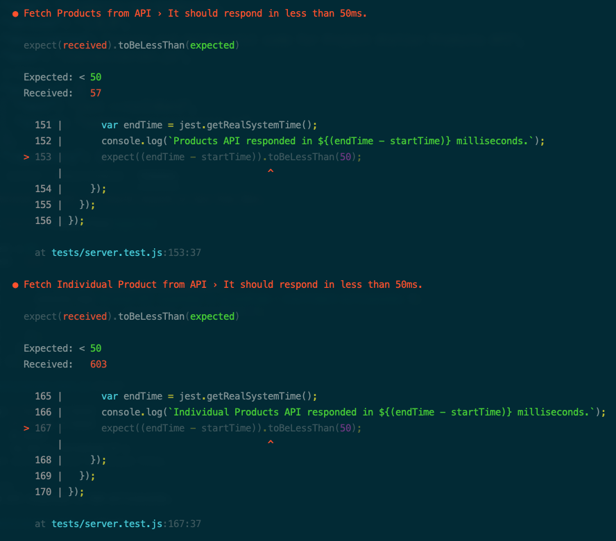

### Measuring Run Time
Before the weeklong break, I successfully got the API functional and returning data as expected. But it is not going to win any speed contests as of yet. The target of the running tests as of the current step is for each call to be returned in less than 50 milliseconds. Currently zero of the four APIs are meeting that mark. Products is the closest at around 60ms. Individual Products and Related are under the 1s mark. But styles is lagging considerably in the 10 to 15 second range.

Obviously, the Styles API is the place where I need to start whittling time down. I have heard comments from many regarding the indexing of Postgres databases, and how vitally important proper index configuration is for the health of timely responses. That is the area that I intend to start my journey over the next few days. Additionally, the Styles API has a good deal of formatting that is done by iteration on the server side. I would like to explore whether I can replace some of that logic with the functionality of the database itself.

